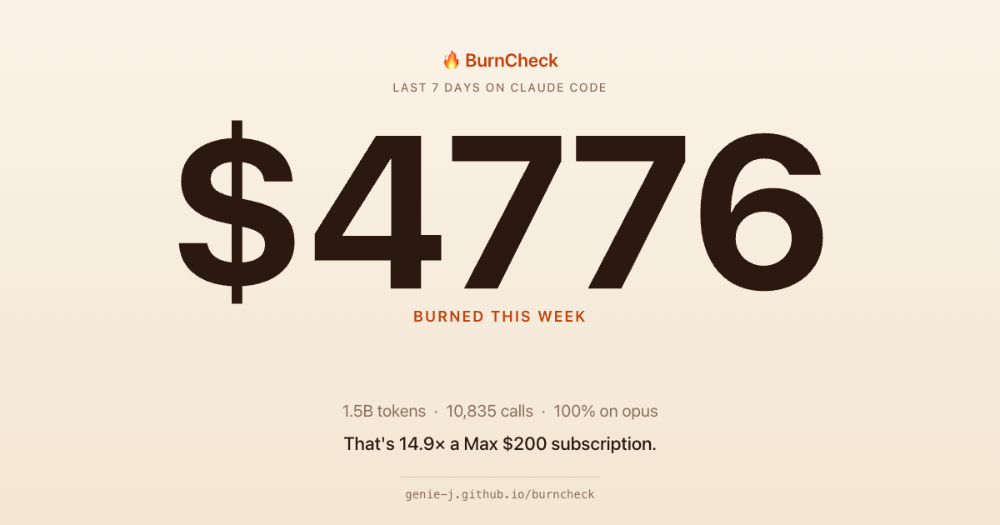

# 🔥 BurnCheck

**Know when Claude will cut you off — before it does.**

[**▶ Try it live →**](https://genie-j.github.io/burncheck/)



Privacy-first burn-rate analyzer for Claude Code users. Pick your `~/.claude/projects/` folder (or paste a single session), and get:

- Projected weekly cost
- Weekly-limit forecast per Max plan tier
- Per-model cost breakdown
- Sessions at risk of hitting the 5-hour cap
- Concrete cost-saving recommendations (model swaps, cache improvements)

**100% client-side.** Your logs never leave your browser tab. No account, no upload, no tracking.

Live: https://genie-j.github.io/burncheck/

## Two ways to run

**Web (recommended):** open https://genie-j.github.io/burncheck/ — pick your `~/.claude/projects/` folder, done.

**CLI (terminal-native):**
```bash
npx github:Genie-J/burncheck
```
Reads your local logs, prints a colored report. See `cli/README.md` for details.

## Local use

Just open `index.html` in any modern browser. That's the whole thing.

## Why

Claude Code paying users on Max tiers ($20 / $100 / $200) hit weekly limits unpredictably, often mid-task. Existing tools (`Claude-Usage-Monitor`, `AgentBoard`) show current state but don't predict. BurnCheck forecasts and recommends.

Not affiliated with Anthropic.

## Roadmap & feedback

- 📋 [v0.1 → v1.0 roadmap](https://github.com/Genie-J/burncheck/issues/2) — vote with 👍 on what to build next
- 💬 [Discussions](https://github.com/Genie-J/burncheck/discussions) — FAQ, feature ideas, show & tell
- 🐛 [Bug reports](https://github.com/Genie-J/burncheck/issues/new) — please include Claude Code version + plan tier
- 🔔 **Watch** the repo (Custom → Releases only) to be notified when Pro launches

## License

MIT. Fork it, break it, improve it.
